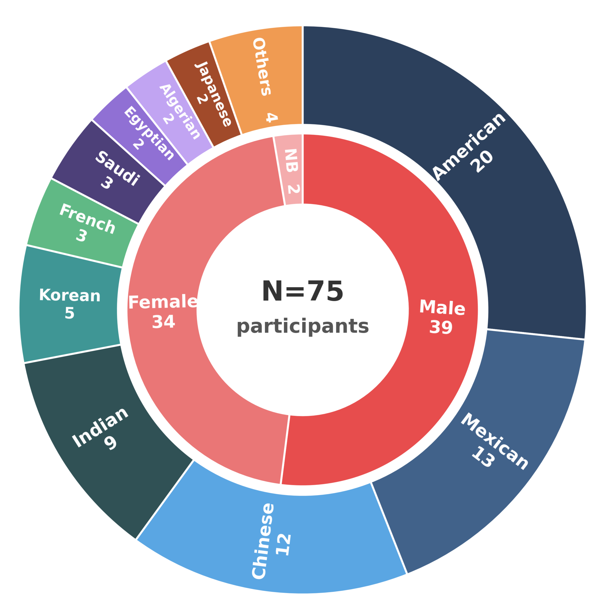
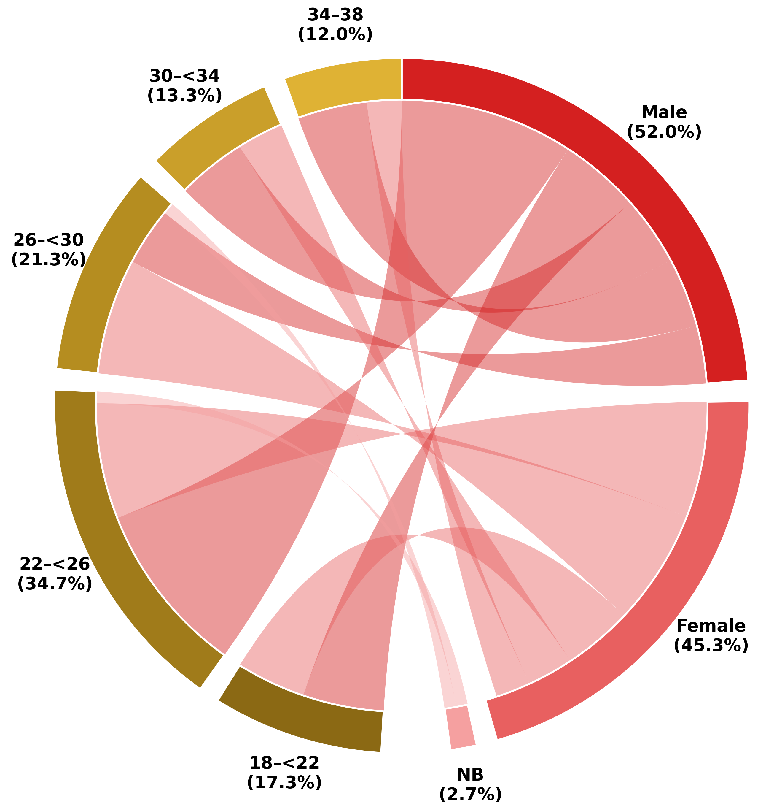
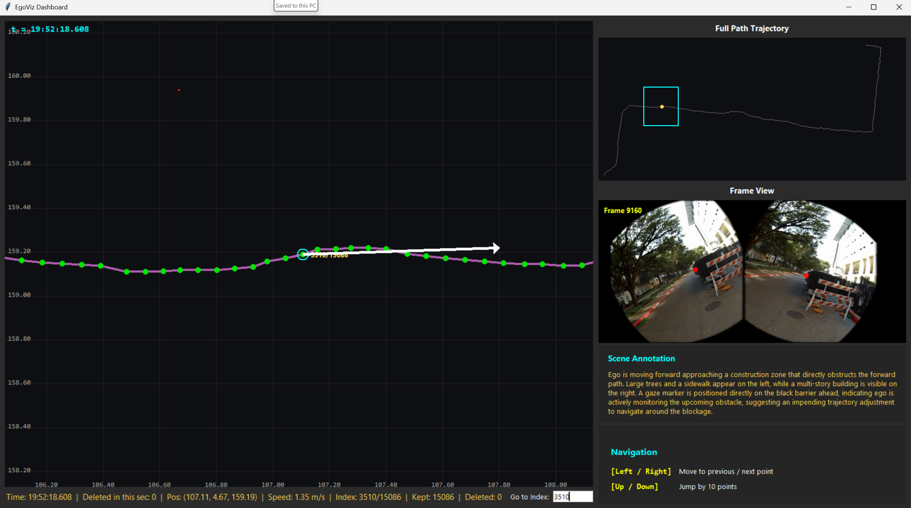
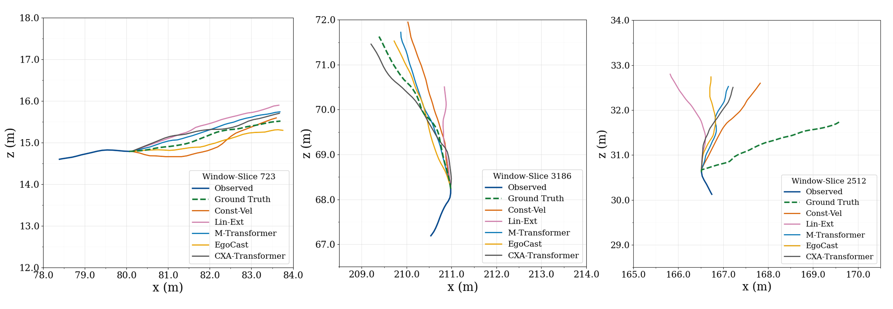
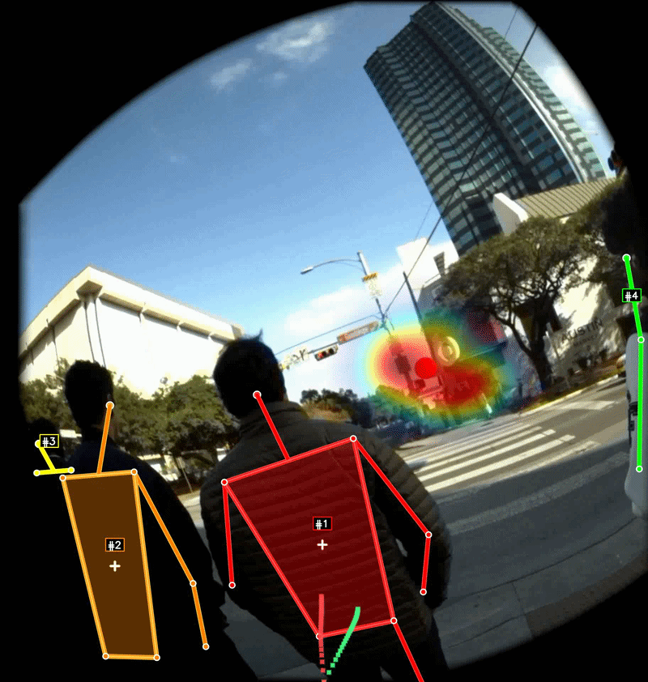

<div align="center">

# EgoTraj: Real-World Egocentric Human Trajectory Dataset for Multimodal Prediction

### UnderReview 2026

[Ahmad Yehia](), [Abduallah Mohamed](), [Tianyi Wang](), [Jiseop Byeon](), [Kun Qian](), [Junfeng Jiao](), [Christian Claudel]()

**The University of Texas at Austin**

<a href="assets/paper/ECCV_2026.pdf"></a>
<a href="assets/paper/ECCV_2026__supplement.pdf"></a>


---


</div>

## Overview

**EgoTraj** is a large-scale, multimodal egocentric trajectory dataset designed to advance research in first-person trajectory forecasting and assistive AR navigation. Collected using **Meta Quest Pro (MQPro)** headsets in real-world urban environments, EgoTraj provides synchronized RGB video, 6DoF head pose, per-frame 3D eye gaze vectors, and structured scene annotations from **75 participants** navigating self-chosen routes across sidewalks, crosswalks, and busy streets.

<div align="center">

</div>

### Why EgoTraj?

Existing human trajectory prediction research relies heavily on bird's-eye view (BEV) or static-camera datasets that capture **where** people move but not **how** they perceive, plan, and initiate their motion from a first-person perspective. The few egocentric trajectory datasets that exist are limited in scale, often collected from a single participant, restricted to indoor environments, or lack synchronized gaze data. **EgoTraj bridges this gap** by being the first large-scale egocentric trajectory dataset to jointly provide:

- Synchronized **6DoF head pose** at 30 Hz
- Per-frame **3D eye gaze vectors** with pixel-level calibration
- **Egocentric RGB video** (1024 x 1024, 30 fps)
- **VLM-generated scene annotations** for navigation-relevant context
- Data from **75 diverse participants** (14 nationalities, ages 18--38, gender-balanced)

---

## Pipeline Overview

<div align="center">

</div>

The EgoTraj pipeline encompasses the full workflow from data collection through egocentric trajectory prediction:

**1. Data Collection** &rarr; Participants wear MQPro headsets and navigate urban environments while the system records synchronized multimodal streams via a custom Unity application paired with a Python recording script.

**2. Data Processing** &rarr; Raw sensor data (50 Hz) and RGB video (30 fps) are temporally aligned, synchronized to a common 30 Hz timeline, privacy-filtered using EgoBlur, and packaged into per-session HDF5 files.

**3. Analysis & Annotation** &rarr; Scene annotations are generated using Qwen2.5-VL-7B, gaze is calibrated to pixel coordinates, and the EgoViz Dashboard enables frame-level quality control.

**4. Trajectory Prediction** &rarr; State-of-the-art baselines are benchmarked on egocentric trajectory forecasting using multimodal inputs (ego-motion, gaze, scene, social context).

---

## Dataset Details

### Recording Setup

Each participant wears a **Meta Quest Pro** headset operating in full-color passthrough mode. The headset integrates:
- A passthrough **RGB camera** (1024 x 1024 @ 30 fps)
- Two infrared **eye-tracking cameras**
- Four inside-out **tracking cameras** for visual-inertial SLAM
- A **6-axis IMU**

A custom Unity application interfaces with the built-in SLAM system and records time-synchronized data at 30 Hz, including 6DoF head pose, 3D gaze origin and direction vectors, and egocentric RGB video. Participants use the MQPro controller to start/stop recording.

### Recording Protocol

- Participants navigate between **7 predefined outdoor waypoints** across urban areas
- Routes are **self-chosen** (not scripted), enabling naturalistic behavior
- Sessions are capped at **15 minutes** (~8 min average)
- A researcher follows at a safe distance for safety monitoring
- Participants obey traffic rules and navigate real crosswalks, sidewalks, and busy streets

### Participant Diversity

<div align="center">


</div>

---

## Dataset Comparison

EgoTraj compared against existing egocentric trajectory datasets:

| Dataset | Year | Setting | Hours | Frames | Subjects | Gaze | 6DoF | Scene Ann. |
|:---|:---:|:---:|:---:|:---:|:---:|:---:|:---:|:---:|
| KrishnaCam | 2016 | Outdoor | 70.0 | 7.6M | 1 | - | - | - |
| EgoMotion | 2016 | In+Out | 9.1 | 65.5K | N/P | - | - | - |
| FPL | 2018 | Outdoor | 4.5 | 162K | N/P | - | - | - |
| Nymeria | 2024 | In+Out | 300 | 32.4M | 264 | Y | Y | Y |
| EgoNav | 2024 | In+Out | 3.3 | 237.6K | N/P | - | Y | - |
| LookOut | 2025 | In+Out | 4.0 | 288K | N/P | Y | Y | - |
| EgoCogNav | 2025 | In+Out | 6.0 | 432K | 17 | Y | Y | - |
| **EgoTraj (Ours)** | **2025** | **Outdoor** | **10.7** | **1.15M** | **75** | **Y** | **Y** | **Y** |


---

## Multimodal Streams

EgoTraj provides rich, synchronized multimodal data per frame:

<div align="center">

</div>

*Each row shows a frame at consecutive timesteps. From left to right: egocentric RGB with gaze fixation (red dot), relative depth (Depth Anything V2), semantic segmentation (OneFormer), detected poses (YOLOv8-Pose) ranked by depth, and ground-truth vs. predicted trajectory.*

### Gaze Calibration

A per-session **quadratic calibration model** maps 3D gaze yaw-pitch angles to pixel coordinates (u, v) in the video frame, enabling direct projection of gaze fixation points into image space.

<div align="center">

</div>

### Scene Annotation

Structured egocentric scene descriptions are generated using **Qwen2.5-VL-7B-Instruct** at 1 fps, targeting navigation-relevant elements: surrounding context, traffic activity, gaze fixation targets, and inferred movement intent.

<div align="center">

</div>

- **96% structural compliance** (with chain-of-thought retries)
- **93% inter-annotator agreement** (verified by two human annotators)

---

## EgoViz Dashboard

We developed **EgoViz**, an interactive visualization and inspection tool for the EgoTraj dataset, synchronizing four complementary views: trajectory plot, BEV path, egocentric RGB frame, and VLM scene annotation.

<div align="center">

</div>

> The **EgoViz Dashboard** will be publicly released alongside the dataset after publication.

---

## Benchmarking Results

### Baselines

We evaluate five methods on egocentric trajectory prediction (1.5s observation &rarr; 3.5s prediction):

| Model | ADE (m) &darr; | FDE (m) &darr; | L1_head &darr; |
|:---|:---:|:---:|:---:|
| Const_Vel | 0.24 | 0.35 | 0.82 |
| Lin_Ext | 0.26 | 0.39 | 1.39 |
| M_Transformer | 0.20 | 0.32 | 0.74 |
| CXA-Transformer | 0.19 | 0.29 | **0.69** |
| **EgoCast** | **0.16** | **0.28** | 0.78 |

### Multimodal Ablation Study

Using CXA-Transformer as the base architecture to analyze the contribution of each modality:

| Modality | ADE (m) &darr; | FDE (m) &darr; | L1_head &darr; |
|:---|:---:|:---:|:---:|
| Y (ego-motion only) | 0.19 | 0.29 | 0.69 |
| Y + G (gaze) | 0.15 | 0.26 | 0.69 |
| Y + S (scene) | 0.16 | 0.26 | 0.74 |
| Y + P (pose) | 0.17 | 0.27 | 0.77 |
| Y + P + G | 0.12 | 0.24 | 0.63 |
| Y + S + G | 0.12 | 0.25 | 0.65 |
| **Y + P + S + G (full)** | **0.12** | **0.23** | **0.58** |

**Key findings:** Gaze and scene segmentation provide the largest individual improvements. The full multimodal combination achieves the best results, demonstrating that visual attention provides predictive signal even on top of rich scene and social context.

### Qualitative Results

<div align="center">

</div>

*Trajectory predictions from multiple baselines on three test scenarios. Left: gentle segment. Center: moderate turn. Right: sharp ~90 degree intersection turn where all baselines underestimate the turning magnitude.*

---

## Egocentric Trajectory Prediction Demo

<div align="center">

</div>


*Egocentric pedestrian trajectory prediction with projected gaze (red dot), detected human poses, depth estimation, and predicted future path overlaid on the egocentric RGB stream.*

---

## Data Release

> The **EgoTraj dataset** and the **EgoViz Dashboard** will be publicly released after publication. Stay tuned for updates.

---

## Citation

If you find this work useful, please cite our paper:

```bibtex
@inproceedings{yehia2026egotraj,
  title     = {EgoTraj: Real-World Egocentric Human Trajectory Dataset for Multimodal Prediction},
  author    = {Yehia, Ahmad and Mohamed, Abduallah and Wang, Tianyi and Qian, Kun and Byeon, Jiseop and Jiao, Junfeng and Claudel, Christian},
  booktitle = {European Conference on Computer Vision (ECCV)},
  year      = {2026}
}
```

---

## License

This project is licensed under the **MASSLab_UT_AUSTIN** License. See [LICENSE](LICENSE) for details.

---

## Acknowledgements

This work is supported by Honda Development and Manufacturing of America, LLC. The authors would like to thank all 75 participants who volunteered for data collection. This study was approved by an Institutional Review Board (IRB). All recordings were privacy-filtered using [EgoBlur](https://github.com/facebookresearch/EgoBlur) for face and license plate de-identification.

---

<div align="center">

**[MASSLab @ UTAustin]()**

</div>
