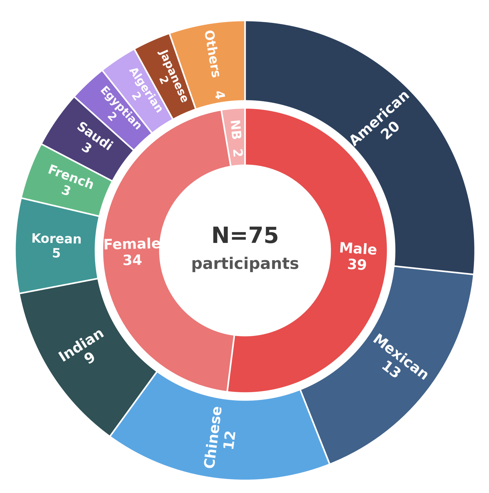
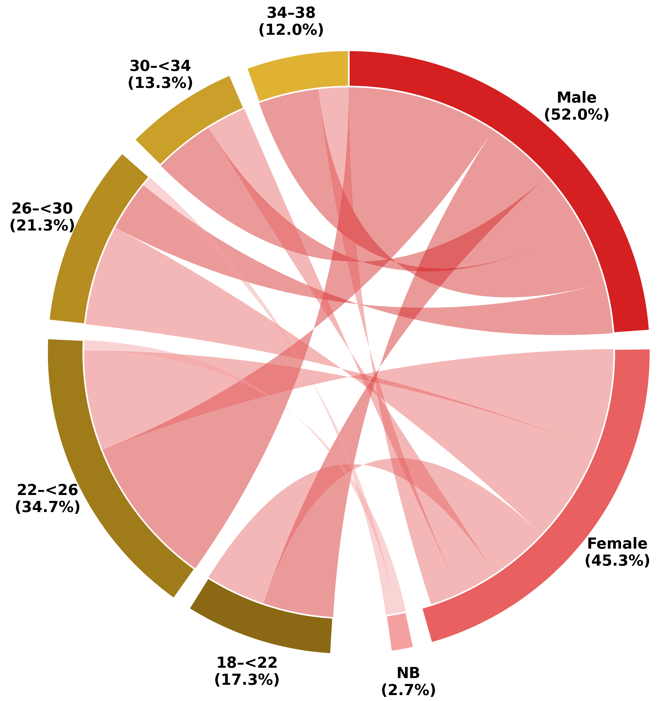
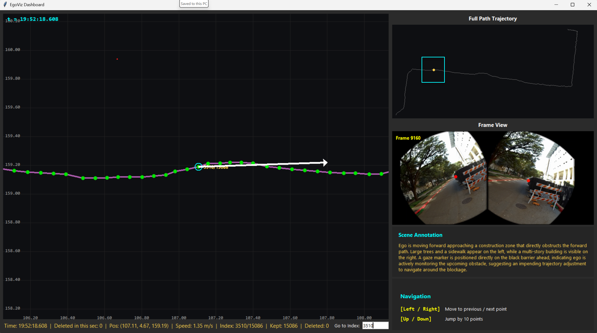
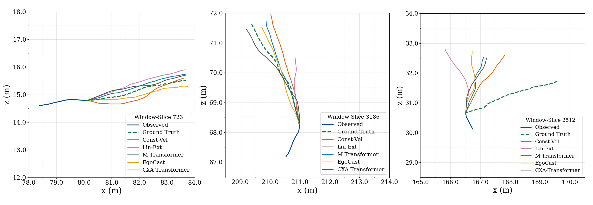
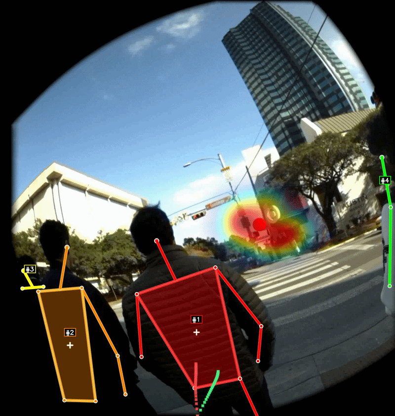
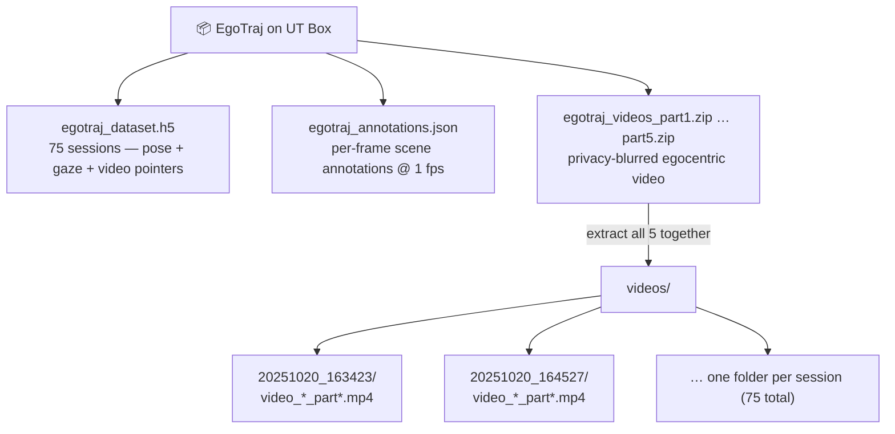

<div align="center">

# EgoTraj: Real-World Egocentric Human Trajectory Multimodal Dataset

### Accepted to ECCV 2026

Ahmad Yehia<sup>1,★</sup>, Abduallah Mohamed<sup>2,★</sup>, Tianyi Wang<sup>1</sup>, Jiseop Byeon<sup>1</sup>, Kun Qian<sup>3</sup>, Junfeng Jiao<sup>1</sup>, Christian Claudel<sup>1</sup>

<sup>1</sup>The University of Texas at Austin, Austin &nbsp;&nbsp; <sup>2</sup>AIDAChip Inc. &nbsp;&nbsp; <sup>3</sup>Unity AI Technologies

<a href="https://arxiv.org/abs/2605.19004"></a>
<a href="assets/paper/EgoTraj_Real-World_Egocentric_Human_Trajectory_Dataset_for_Multimodal_Prediction.pdf"></a>
<a href="https://utexas.box.com/s/kszvh58csvk8duu3qywqxp05a9fhsvph"></a>


---


</div>

## Overview

**EgoTraj** is a large-scale, multimodal egocentric trajectory dataset designed to advance research in first-person trajectory forecasting and assistive AR navigation. Collected using **Meta Quest Pro (MQPro)** headsets in real-world urban environments, EgoTraj provides synchronized RGB video, 6DoF head pose, per-frame 3D eye gaze vectors, and structured scene annotations from **75 participants** navigating self-chosen routes across sidewalks, crosswalks, and busy streets.

<div align="center">

</div>

### Why EgoTraj?

Existing human trajectory prediction research relies heavily on bird's-eye view (BEV) or static-camera datasets that capture **where** people move but not **how** they perceive, plan, and initiate their motion from a first-person perspective. The few egocentric trajectory datasets that exist are limited in scale, often collected from a single participant, restricted to indoor environments, or lack synchronized gaze data. **EgoTraj bridges this gap** by being the first large-scale egocentric trajectory dataset to jointly provide:

- Synchronized **6DoF head pose** at 30 Hz
- Per-frame **3D eye gaze vectors** with pixel-level calibration
- **Egocentric RGB video** (1024 x 1024, 30 fps)
- **VLM-generated scene annotations** for navigation-relevant context
- Data from **75 diverse participants** (14 nationalities, ages 18--38, gender-balanced)

---

## Pipeline Overview

<div align="center">

</div>

The EgoTraj pipeline encompasses the full workflow from data collection through egocentric trajectory prediction:

**1. Data Collection** &rarr; Participants wear MQPro headsets and navigate urban environments while the system records synchronized multimodal streams via a custom Unity application paired with a Python recording script.

**2. Data Processing** &rarr; Raw sensor data (50 Hz) and RGB video (30 fps) are temporally aligned, synchronized to a common 30 Hz timeline, privacy-filtered using EgoBlur, and packaged into per-session HDF5 files.

**3. Analysis & Annotation** &rarr; Scene annotations are generated using Qwen2.5-VL-7B, gaze is calibrated to pixel coordinates, and the EgoViz Dashboard enables frame-level quality control.

**4. Trajectory Prediction** &rarr; State-of-the-art baselines are benchmarked on egocentric trajectory forecasting using multimodal inputs (ego-motion, gaze, scene, social context).

---

## Dataset Details

### Recording Setup

Each participant wears a **Meta Quest Pro** headset operating in full-color passthrough mode. The headset integrates:
- A passthrough **RGB camera** (1024 x 1024 @ 30 fps)
- Two infrared **eye-tracking cameras**
- Four inside-out **tracking cameras** for visual-inertial SLAM
- A **6-axis IMU**

A custom Unity application interfaces with the built-in SLAM system and records time-synchronized data at 30 Hz, including 6DoF head pose, 3D gaze origin and direction vectors, and egocentric RGB video. Participants use the MQPro controller to start/stop recording.

### Recording Protocol

- Participants navigate between **7 predefined outdoor waypoints** across urban areas
- Routes are **self-chosen** (not scripted), enabling naturalistic behavior
- Sessions are capped at **15 minutes** (~8 min average)
- A researcher follows at a safe distance for safety monitoring
- Participants obey traffic rules and navigate real crosswalks, sidewalks, and busy streets

### Participant Diversity

<div align="center">


</div>

---

## Dataset Comparison

EgoTraj compared against existing egocentric trajectory datasets:

| Dataset | Year | Setting | Hours | Frames | Subjects | Gaze | 6DoF | Scene Ann. |
|:---|:---:|:---:|:---:|:---:|:---:|:---:|:---:|:---:|
| KrishnaCam | 2016 | Outdoor | 70.0 | 7.6M | 1 | - | - | - |
| EgoMotion | 2016 | In+Out | 9.1 | 65.5K | N/P | - | - | - |
| FPL | 2018 | Outdoor | 4.5 | 162K | N/P | - | - | - |
| Nymeria | 2024 | In+Out | 300 | 32.4M | 264 | Y | Y | Y |
| EgoNav | 2024 | In+Out | 3.3 | 237.6K | N/P | - | Y | - |
| LookOut | 2025 | In+Out | 4.0 | 288K | N/P | Y | Y | - |
| EgoCogNav | 2025 | In+Out | 6.0 | 432K | 17 | Y | Y | - |
| **EgoTraj (Ours)** | **2026** | **Outdoor** | **10.7** | **1.15M** | **75** | **Y** | **Y** | **Y** |


---

## Multimodal Streams

EgoTraj provides rich, synchronized multimodal data per frame:

<div align="center">

</div>

*Each row shows a frame at consecutive timesteps. From left to right: egocentric RGB with gaze fixation (red dot), relative depth (Depth Anything V2), semantic segmentation (OneFormer), detected poses (YOLOv8-Pose) ranked by depth, and ground-truth vs. predicted trajectory.*

### Gaze Calibration

A per-session **quadratic calibration model** maps 3D gaze yaw-pitch angles to pixel coordinates (u, v) in the video frame, enabling direct projection of gaze fixation points into image space.

<div align="center">

</div>

### Scene Annotation

Structured egocentric scene descriptions are generated using **Qwen2.5-VL-7B-Instruct** at 1 fps, targeting navigation-relevant elements: surrounding context, traffic activity, gaze fixation targets, and inferred movement intent.

<div align="center">

</div>

- **96% structural compliance** (with chain-of-thought retries)
- **93% inter-annotator agreement** (verified by two human annotators)

---

## EgoViz Dashboard

We developed **EgoViz**, an interactive visualization and inspection tool for the EgoTraj dataset, synchronizing four complementary views: trajectory plot, BEV path, egocentric RGB frame, and VLM scene annotation.

<div align="center">

</div>

> EgoViz ships with this repo as [`ego_viz.py`](ego_viz.py). See [Dataset Download &amp; Format](#dataset-download--format) below to get the data and run it.

---

## Benchmarking Results

### Baselines

We evaluate five methods on egocentric trajectory prediction (1.5s observation &rarr; 3.5s prediction):

| Model | ADE (m) &darr; | FDE (m) &darr; | L1_head &darr; |
|:---|:---:|:---:|:---:|
| Const_Vel | 0.24 | 0.35 | 0.82 |
| Lin_Ext | 0.26 | 0.39 | 1.39 |
| M_Transformer | 0.20 | 0.32 | 0.74 |
| CXA-Transformer | 0.19 | 0.29 | **0.69** |
| **EgoCast** | **0.16** | **0.28** | 0.78 |

### Generalization Across Splits

To examine how well the multimodal models generalize beyond the random-participant split, we evaluated CXA-Transformer on two additional, stricter splits. The **waypoint-pair held-out split** reserves 3 of the 21 origin&ndash;destination pairs entirely for testing (*n* = 10 sessions), and the **unfamiliar split** reserves 8 of the 31 participants who reported being unfamiliar with the recording environment (*n* = 8 sessions). By construction, each session is contributed by a unique participant, so all three splits are subject-disjoint.

<div align="center">

<table>
<thead>
<tr>
<th rowspan="2">Modality</th>
<th colspan="2">Random Participant (<i>n</i> = 8)</th>
<th colspan="2">Waypoint Held-Out (<i>n</i> = 10)</th>
<th colspan="2">Unfamiliar (<i>n</i> = 8)</th>
</tr>
<tr>
<th>ADE &darr;</th><th>FDE &darr;</th>
<th>ADE &darr;</th><th>FDE &darr;</th>
<th>ADE &darr;</th><th>FDE &darr;</th>
</tr>
</thead>
<tbody>
<tr><td>Y</td><td>0.19<sub>±.014</sub></td><td>0.29<sub>±.021</sub></td><td>0.21<sub>±.018</sub></td><td>0.32<sub>±.024</sub></td><td>0.23<sub>±.019</sub></td><td>0.34<sub>±.027</sub></td></tr>
<tr><td>Y + P</td><td>0.17<sub>±.011</sub></td><td>0.27<sub>±.019</sub></td><td>0.19<sub>±.015</sub></td><td>0.29<sub>±.022</sub></td><td>0.20<sub>±.013</sub></td><td>0.31<sub>±.020</sub></td></tr>
<tr><td>Y + S</td><td>0.16<sub>±.013</sub></td><td>0.25<sub>±.014</sub></td><td>0.18<sub>±.012</sub></td><td>0.28<sub>±.018</sub></td><td>0.18<sub>±.016</sub></td><td>0.29<sub>±.023</sub></td></tr>
<tr><td>Y + G</td><td>0.15<sub>±.009</sub></td><td>0.26<sub>±.017</sub></td><td>0.16<sub>±.014</sub></td><td>0.26<sub>±.013</sub></td><td>0.16<sub>±.010</sub></td><td>0.29<sub>±.018</sub></td></tr>
<tr><td><b>Y + P + S + G</b></td><td><b>0.12</b><sub>±.008</sub></td><td><b>0.23</b><sub>±.012</sub></td><td><b>0.14</b><sub>±.010</sub></td><td><b>0.25</b><sub>±.011</sub></td><td><b>0.14</b><sub>±.012</sub></td><td><b>0.26</b><sub>±.014</sub></td></tr>
</tbody>
</table>

</div>

*Generalization across three test splits using CXA-Transformer. Values are ADE/FDE in meters with 95% bootstrap confidence intervals from 1000 resamples. Best per split in **bold**.*

**Key findings:** The full multimodal configuration (Y + P + S + G) remains the strongest across all three splits, with a modest generalization gap (random-participant ADE 0.12 &rarr; waypoint-held-out ADE 0.14 &rarr; unfamiliar ADE 0.14). This indicates that the multimodal cues transfer to held-out landmark pairs and to participants unfamiliar with the area, rather than overfitting to specific route templates.

### Qualitative Results

<div align="center">

</div>

*Trajectory predictions from multiple baselines on three test scenarios. Left: gentle segment. Center: moderate turn. Right: sharp ~90 degree intersection turn where all baselines underestimate the turning magnitude.*

---

## Egocentric Trajectory Prediction Demo

<div align="center">

</div>


*Egocentric pedestrian trajectory prediction with projected gaze (red dot), detected human poses, depth estimation, and predicted future path overlaid on the egocentric RGB stream.*

---

## Dataset Download & Format

**Download:** [EgoTraj dataset (UT Box)](https://utexas.box.com/s/kszvh58csvk8duu3qywqxp05a9fhsvph)


```mermaid
flowchart TD
    BOX["📦 EgoTraj on UT Box"]
    BOX --> H5["egotraj_dataset.h5<br/>75 sessions — pose + gaze + video pointers"]
    BOX --> JSON["egotraj_annotations.json<br/>per-frame scene annotations @ 1 fps"]
    BOX --> ZIPS["egotraj_videos_part1.zip … part5.zip<br/>privacy-blurred egocentric video"]
    ZIPS -->|extract all 5 together| VID["videos/"]
    VID --> S1["20251020_163423/<br/>video_*_part*.mp4"]
    VID --> S2["20251020_164527/<br/>video_*_part*.mp4"]
    VID --> S3["… one folder per session (75 total)"]
```

EgoTraj is distributed as two lightweight files plus the RGB video (hosted separately).

### `egotraj_dataset.h5`

One HDF5 group per session (named by capture timestamp). Each session contains:
- **Head pose** — `pose/position` (N×3, meters), `pose/rotation` (N×4 quaternion, `qw,qx,qy,qz`), `pose/velocity`, `pose/angular_velocity`, `pose/timestamp` (epoch seconds).
- **Gaze** — `gaze/direction` (N×3 unit vectors) and `gaze/origin` (N×3).
- **Video pointers** — `video/segment`, `video/frame`, `video/has_video`, mapping each pose sample to a frame in the blurred video.
- **Route waypoints** (group attributes) — `waypoint_start`, `waypoint_end`, `from`, `to`.

> **Coordinate note:** **Y is the up-axis** (height). The ground plane is `(x, z)`. Positions are **session-relative** — each session has its own local origin — and are **not** absolute or geographic coordinates.

### `egotraj_annotations.json`

A list of per-frame scene annotations sampled at 1 fps. Each record has `session`, `pose_idx` (the join key back into the H5), `timestamp`, `second`, `gaze_dot` (the detected gaze-marker location, or `null` if off-frame), and `annotation` (a short scene description covering context, the gaze target, and inferred intent).

To join an annotation to its trajectory and gaze, index the session's H5 datasets at `pose_idx`.

### Video (`egotraj_videos_part1.zip` … `egotraj_videos_part5.zip`)

Privacy-blurred egocentric video, organized into per-session folders and referenced by the H5 `video/segment` / `video/frame` pointers. The red gaze dot is rendered into the video at capture time.

> ⚠️ **Download all five parts together.** The video is split across five archives (`egotraj_videos_part1.zip` through `egotraj_videos_part5.zip`); the set is only complete with all five. Download every part and extract them into a single shared `videos/` folder, then point EgoViz at it with `--videos-root videos/`.

### Using the EgoViz Dashboard

[`ego_viz.py`](ego_viz.py) is an interactive dashboard that synchronizes four views for a session: the local trajectory plot, the full-path minimap, the egocentric video frame, and the scene annotation.

**Install dependencies:**

```bash
pip install -r requirements.txt
```

`tkinter` ships with standard CPython; on Debian/Ubuntu install it with `apt-get install python3-tk`.

**Run on a session:**

```bash
python ego_viz.py \
  --h5 egotraj_dataset.h5 \
  --session 20251020_163423 \
  --videos-root videos/ \
  --annotations-json egotraj_annotations.json
```

| Flag | Description |
|:---|:---|
| `--h5` | Path to `egotraj_dataset.h5`. |
| `--session` | Session key = HDF5 group name (e.g. `20251020_163423`). |
| `--videos-root` | Parent folder of per-session video subfolders (each holding `video_*_part*.mp4`); enables the session dropdown. Use `--videos <folder>` to point at a single session's videos instead. |
| `--annotations-json` | Path to `egotraj_annotations.json`; the matching annotation is shown for the current second. |

Trajectory-only mode works without video or annotations — just pass `--h5` and `--session`.

**Controls:** &larr;/&rarr; step by one point, &uarr;/&darr; by 10, PgUp/PgDn by 100, Home/End jump to start/end; mouse wheel zooms, right-click + drag pans; press **H** or **?** for the full shortcut list (including QC/editing keys), **Q**/**Esc** to quit.

---

## Citation

If you find this work useful, please cite our paper:

```bibtex
@inproceedings{yehia2026egotraj,
  title     = {EgoTraj: Real-World Egocentric Human Trajectory Dataset for Multimodal Prediction},
  author    = {Yehia, Ahmad and Mohamed, Abduallah and Wang, Tianyi and Byeon, Jiseop and Qian, Kun and Jiao, Junfeng and Claudel, Christian},
  booktitle = {European Conference on Computer Vision (ECCV)},
  year      = {2026},
  eprint    = {2605.19004},
  archivePrefix = {arXiv},
  primaryClass  = {cs.CV}
}
```

---

## License

This project is licensed under the **MIT License**. See [LICENSE](LICENSE) for details.

---

## Acknowledgements

This work was supported by Honda Development & Manufacturing of America, LLC. We thank Jorge Monsivais, Haithi Donahue, and Steven Feit of the Emerging Technology Department for their contributions. We are also grateful to [Kristen Grauman](https://www.cs.utexas.edu/~grauman/) at UT Austin for her guidance throughout the data collection.
